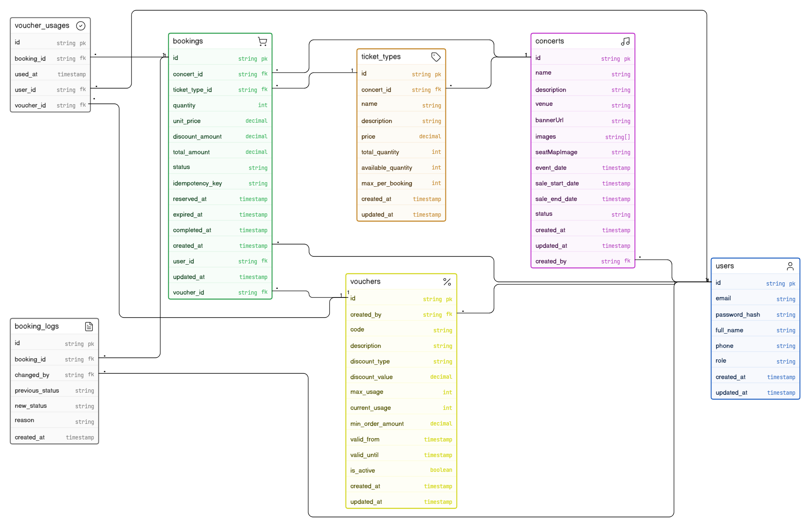

# Database Design — Melotix

Tài liệu này chi tiết về cấu trúc dữ liệu, các quan hệ (Relationships) và chiến lược tối ưu hóa database (Indexing) cho hệ thống Melotix.

---

## 1. Entity Relationship Diagram (ERD)

Dưới đây là sơ đồ quan hệ thực thể của hệ thống:

---

## 2. Chi tiết các Collections

### 2.1. User
Lưu trữ thông tin người dùng và phân quyền.
- `_id`: ObjectId (Primary Key)
- `email`: String (Unique, Required)
- `passwordHash`: String (Bcrypt)
- `fullName`: String
- `phone`: String
- `role`: Enum ["USER", "ADMIN"]

### 2.2. Concert
Lưu trữ thông tin sự kiện âm nhạc.
- `_id`: ObjectId
- `name`: String
- `description`: String
- `venue`: String (Địa điểm)
- `eventDate`: Date (Thời gian diễn ra)
- `saleStartDate`: Date (Bắt đầu bán vé)
- `saleEndDate`: Date (Kết thúc bán vé)
- `status`: Enum ["DRAFT", "ACTIVE", "ENDED", "CANCELLED"]
- `bannerUrl`: String
- `seatMapImage`: String
- `images`: Array [String] (Gallery)

### 2.3. TicketType
Lưu trữ các hạng vé của từng concert (VIP, Standard, v.v.).
- `concertId`: ObjectId (Ref: Concert)
- `name`: String
- `price`: Number
- `totalQuantity`: Number (Tổng số vé phát hành)
- `availableQuantity`: Number (Số vé còn lại có thể bán)
- `maxPerBooking`: Number (Số vé tối đa trong 1 đơn)

### 2.4. Booking
Lưu trữ thông tin giao dịch đặt vé.
- `userId`: ObjectId (Ref: User)
- `concertId`: ObjectId (Ref: Concert)
- `ticketTypeId`: ObjectId (Ref: TicketType)
- `quantity`: Number
- `totalAmount`: Number
- `status`: Enum ["RECEIVED", "RESERVED", "WAITING_PAYMENT", "CONFIRMED", "CANCELLED", "EXPIRED"]
- `idempotencyKey`: String (Unique - Chống duplicate)
- `expiredAt`: Date (Thời hạn giữ chỗ)

### 2.5. Voucher & VoucherUsage
Quản lý khuyến mãi và lịch sử sử dụng.
- **Voucher:** `code`, `discountType`, `discountValue`, `maxUsage`, `currentUsage`.
- **VoucherUsage:** `voucherId`, `userId`, `bookingId`.

---

## 3. Chiến lược Indexing (Tối ưu hóa)

Để đảm bảo hệ thống phản hồi nhanh dưới tải cao, các index sau đã được thiết lập:

| Collection | Index Fields | Mục đích |
|---|---|---|
| **User** | `email: 1` (Unique) | Truy xuất tài khoản khi login. |
| **Concert** | `status: 1`, `eventDate: 1` | Tối ưu bộ lọc tìm kiếm concert. |
| **TicketType** | `concertId: 1` | Lấy nhanh các hạng vé của 1 sự kiện. |
| **Booking** | `idempotencyKey: 1` (Unique) | Chặn các request trùng lặp (Double Booking). |
| **Booking** | `userId: 1`, `concertId: 1` | Lấy lịch sử mua vé nhanh chóng. |
| **VoucherUsage** | `voucherId: 1, userId: 1` (Unique) | **Quan trọng:** Chặn 1 người dùng 1 voucher 2 lần. |

---

## 4. Ràng buộc toàn vẹn (Integrity)

1. **Atomic Inventory:** Số lượng vé (`availableQuantity`) luôn được cập nhật bằng toán tử nguyên tử (`$inc`) để tránh Race Condition.
2. **Transaction Support:** Toàn bộ luồng đặt vé (Trừ vé + Tạo booking + Lưu Voucher) được bọc trong **MongoDB Session Transaction**. Nếu một bước lỗi, toàn bộ dữ liệu sẽ được Rollback.
