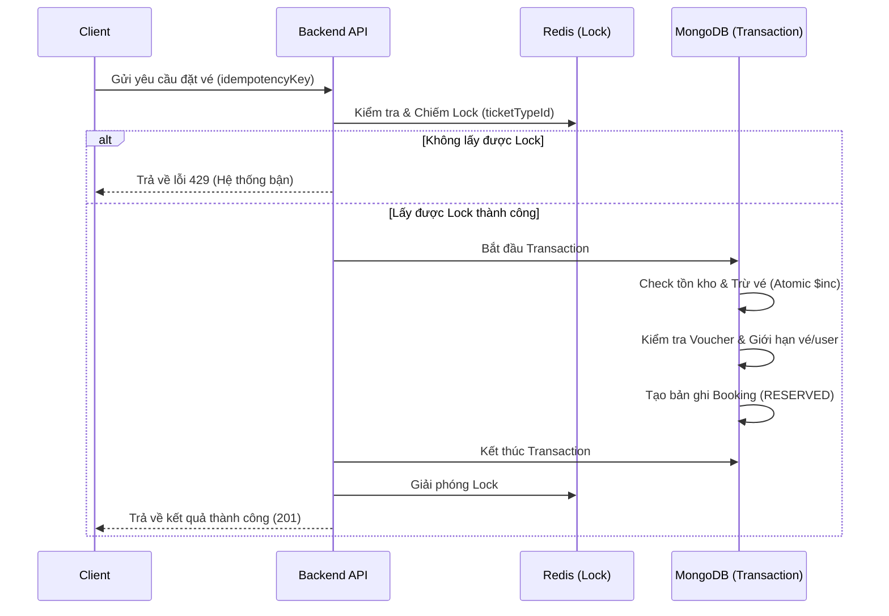

# System Design — Melotix

Tài liệu này mô tả kiến trúc tổng quan, các luồng xử lý nghiệp vụ và các giải pháp kỹ thuật cho nền tảng Melotix.

---

## 1. Kiến trúc tổng quan (Architecture)

Hệ thống được thiết kế theo mô hình Monolithic hiện đại với khả năng mở rộng ngang:
- **Backend:** Node.js (Express) sử dụng ES Modules.
- **Cache & Concurrency Layer:** Redis (Distributed Locking).
- **Primary Database:** MongoDB (Transactions support).
- **Background Jobs:** Node.js Internal Interval (Xử lý hết hạn giữ chỗ).

---

## 2. Luồng đặt vé (Booking Flow)

Hệ thống xử lý đặt vé theo quy trình 3 lớp bảo vệ để đảm bảo tính ổn định:

---

## 3. Giải pháp cho các vấn đề Concurrency

| Vấn đề | Giải pháp kỹ thuật |
|---|---|
| **Overselling (Bán quá số lượng)** | Kết hợp **Redis Distributed Lock** và **Atomic Update** ở tầng Database. Chỉ 1 request được xử lý tồn kho tại 1 thời điểm. |
| **Race Condition** | Sử dụng **MongoDB Transactions** để đảm bảo tính ACID: hoặc là tất cả (Trừ vé, tạo đơn, lưu voucher) thành công, hoặc là không có gì thay đổi. |
| **Double Booking** | Sử dụng **Idempotency Key (UUID)**. Nếu người dùng bấm 2 lần, hệ thống nhận diện key trùng và trả về kết quả cũ thay vì tạo đơn mới. |
| **Spam / Bot Attack** | **Rate Limiting Middleware** giới hạn 5 request/phút trên mỗi tài khoản người dùng. |
| **Scalping (Gom vé)** | **Max Tickets Limit** giới hạn tối đa 10 vé cho mỗi Concert trên mỗi tài khoản. |

---

## 4. Quản lý trạng thái Booking (State Machine)

Booking di chuyển qua các trạng thái nghiêm ngặt để bảo vệ tồn kho:

1. **RESERVED:** Vé đã bị trừ, hệ thống giữ chỗ trong 15 phút.
2. **WAITING_PAYMENT:** Người dùng xác nhận thanh toán (đang chờ gateway).
3. **CONFIRMED:** Giao dịch thành công, vé được xác nhận chính thức.
4. **EXPIRED:** Sau 15 phút không thanh toán, hệ thống tự động hoàn lại vé vào kho.
5. **CANCELLED:** Người dùng hoặc Admin chủ động hủy đơn, hoàn lại vé.

---

## 5. Khả năng mở rộng (Scalability)

- **Stateless API:** Backend có thể chạy nhiều instance qua Docker/PM2 để chia tải.
- **Database Indexing:** Đã tối ưu hóa các trường tìm kiếm thường xuyên.
- **Caching:** Có thể mở rộng để cache danh sách Concert vào Redis nhằm giảm tải cho MongoDB.
